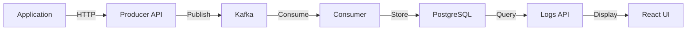

# Spunkless - Distributed Logging System

A modern, scalable logging infrastructure built with Node.js, Kafka, and PostgreSQL. Live at [spunkless.xyz](https://spunkless.xyz)

## System Architecture



The system consists of:

1. **Log Producer** - REST API for receiving logs from applications
2. **Kafka** - Message broker for reliable message delivery
3. **Log Consumer** - Service that consumes logs from Kafka and stores them in PostgreSQL
4. **PostgreSQL** - Database with partitioning and full-text search
5. **Logs API** - REST API for searching and analyzing logs
6. **React UI** - Frontend dashboard for visualization and search

## Features

- **High-throughput log ingestion** via Kafka message broker
- **Advanced search capabilities** with full-text search and metadata filtering
- **Real-time analytics** with aggregations and statistics
- **Horizontal scalability** across all components
- **Table partitioning** for efficient storage and querying
- **SSL/TLS secured** with nginx reverse proxy

## Tech Stack

- **Backend**: Node.js, Express.js
- **Message Broker**: Apache Kafka with Zookeeper
- **Database**: PostgreSQL with GIN indexing
- **Frontend**: React, TailwindCSS
- **Infrastructure**: Docker, Docker Compose, DigitalOcean
- **CI/CD**: GitHub Actions

## Prerequisites

- Docker and Docker Compose
- Node.js 18+ (for local development)

## Quick Start

1. Clone the repository:
   ```bash
   git clone https://github.com/SrinivasJoshi/spunkless.git
   cd spunkless
   ```

2. Start the services:
   ```bash
   docker-compose -f docker-compose.local.yml up -d --build
   ```

3. Send a test log:
   ```bash
   curl -X POST http://localhost:8000/spunkless-producer-api/logs \
     -H "Content-Type: application/json" \
     -d '{
       "service": "test-service",
       "level": "info",
       "message": "Test log message"
     }'
   ```

4. Access the UI at http://localhost

## Services

### Producer (Port 8000)
- **POST /spunkless-producer-api/logs** - Submit logs to the system
- Creates Kafka topics dynamically per service
- Handles message serialization and delivery

### Consumer 
- Processes logs from Kafka topics
- Implements table partitioning by timestamp
- Creates GIN indexes for full-text search
- Handles concurrent topic subscription

### Logs API (Port 8002)
- **GET /api/logs** - Get logs with filtering and pagination
- **POST /api/logs/search** - Advanced search with full-text capabilities
- **GET /api/stats** - Real-time statistics and aggregations
- **GET /api/metadata** - Available services and log levels

### UI (Port 80/443)
- React-based dashboard
- Real-time log visualization
- Advanced filtering and search
- Log analytics and statistics

## Deployment

The system is deployed to DigitalOcean using:
- Docker Compose for container orchestration
- GitHub Actions for CD
- Let's Encrypt for SSL certificates
- Nginx for reverse proxy and SSL termination

## Architecture Decisions

1. **Table Partitioning**: PostgreSQL tables are partitioned by month for efficient querying
2. **Full-text Search**: GIN indexes on message and metadata fields
3. **Dynamic Topics**: Each service gets its own Kafka topic
4. **Microservices**: Each component can scale independently
5. **SSL/TLS**: Production deployment uses HTTPS with Let's Encrypt

## License

MIT